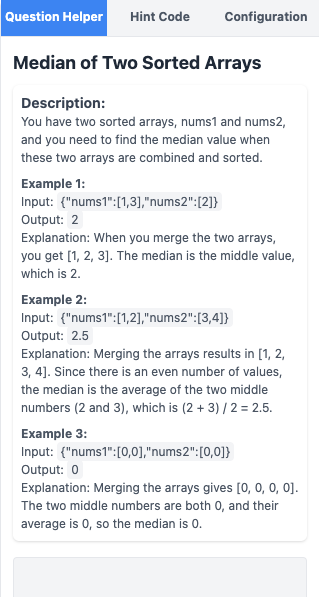
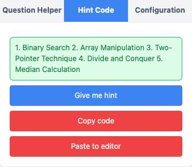

# Leetcoper

## About This Project

As someone who has been practicing LeetCode for a while, I often find myself searching for hints or consulting ChatGPT when I get stuck. This inspired me to create **Leetcoper**, a Chrome extension designed to simplify questions, assist with clarifications, and even generate code when you're completely stuck.

With a background in frontend development, I built this extension using [Plasmo extension](https://docs.plasmo.com/). This is my first time building a Chrome extension, so there might be unconventional practices or areas for improvement. If you spot anything, please open an issue, share your feedback, and feel free to contribute!

## Features

1. **Question Helper**
   - Simplifies complex questions for easier understanding.
   - Includes a chatbot to assist when you don't understand the question.

   

2. **Hint Code**
   - Button to generate hints for solving the problem.
   - Button to generate code (automatically detects your editor's programming language).
     - Option to paste the code directly to the clipboard.
     - Option to paste the code directly into your editor.

   

## How to Use

1. Install packages:

   ```bash
   pnpm install
   ```

2. Build it:

   ```bash
   pnpm build
   ```

3. Open your browser and load `build/chrome-mv3-prod`.

## How to Develop

1. Install packages:

   ```bash
   pnpm install
   ```

2. Run the development server:

    ```bash
    pnpm dev
    ```

3. Open your browser and load the appropriate development build. For example, if you are developing for the chrome browser, using manifest v3, use: `build/chrome-mv3-dev`.

## Disclaimer

1. **Not Affiliated with LeetCode**  
   This extension is an independent project and is not affiliated with, endorsed by, or in partnership with LeetCode.

2. **Educational Purposes Only**  
   This extension is provided **free of charge** and is not commercialized. It is intended solely for educational purposes and to help developers learn and practice coding.

3. **Use at Your Own Risk**  
   While this extension is designed to enhance the user experience, the developers are not responsible for any issues or misuse that may arise from its use.

## Submit to the Webstores

Currently, I don't have any plans to submit it to the extension store.
